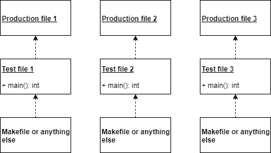
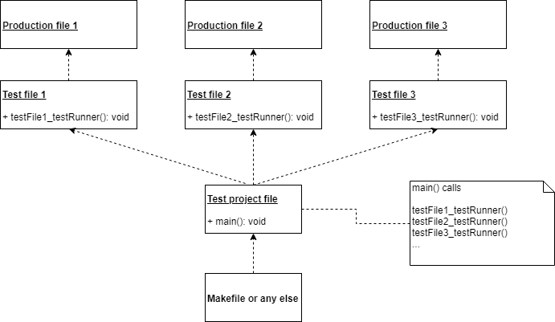

# Getting Started

This document presents firstly the structure of Houdini, secondly how to use it and finally some important details.

## Presentation of Houdini directory structure

By cloning or downloading Houdini, you get

```
houdini
|-- doc
|-- example
|-- src
|-- test
```
where
* *docs* is the folder of Houdini documentation
* *example* presents the example used within this document
* *src* is the folder of the Houdini source code: *test.h* and *houdini.h*
* *test* is the folder of the Houdini's test project

In this getting started, we use the example source code which is:

```
houdini
|-- example
    |-- app
        |-- adc.h
        |-- application.c
    |-- utest
        |-- Makefile
        |-- utest.c
```
where
* *application.c* is the code under test
* *adc.h* is the code that the code under test  depends on (i.e. this is the dependency of the code under test)
* *utest.c* is the test code (i.e. test cases and test runner)
* *Makefile* is the test project definition

The test cases defined in *utest.c* test functions defined in *application.c* that depends on *adc.h*. The *makefile* build the test project using GCC tool chain.

## Project setup

Before going into the example, it is important to see the global project structure, firstly in a project definition (a makefile using GCC in our case) and then in the framework as is.

### In project definition (*makefile*)

The test project compiles the test file and doing so it must instruct the compiler with the paths of the code under test and the Houdini source code such way that the references are resolved. The example uses GCC tool chain but **can be any type of development environment for any target**. Here is the *Makefile* of the test project:

``` bash
all:
	gcc -I"../../src" -I"../../example/app" -Wall -o utest.exe utest.c
```

Note that it is important to add ``-Wall`` compiler option. Explanation later.

### In Houdini framework (*Houdini.h* and *test.h*)

Houdini framework is made of two files: *Houdini.h* that is the implementation of the mock mechanism and *test.h* that defines the way used by Houdini to output the test results. *Houdini.h* is portable and should not be modified. *test.h* can be modified by developers for their given development environments.  

*test.h* makes 4 definitions:
* ``PRINT(text)`` that prints the given *text*
* ``PRINT_INT(nb)`` that prints the given number *nb* in integer format
* ``FLUSH()`` that blocks until all data has been outputted correctly
* ``ASSERT(test)`` that outputs an error if the given *test* is false

The release version of Houdini uses ``printf`` and ``fflush`` in *test.h*. If your development environment supports them, you can let *test.h* unchanged. If not, developers most adjust them accordingly but modifying the definitions for a microcontroller (or another kind of output) should not be a challenge.

## The shelled example

 In this section, the example from test file *utest.c* that tests the code under test *application.c* that depends on *adc.h* is explained. Here is the relation between each element:

 

Precisely, this section presents almost all Houdini's macros:

* ``CREATE_MOCK_x(...)``
* ``TEST(testName) ... END_TEST``
* ``SUB(funcName, subName, nbOfCalls)``
* ``ASSERT(test)``
* ``RUN_TEST(testName)``
* ``CALLING_INDEX(cutName)``

 The next section completes the presentation of the rest of Houdini's macros.


## General setup and teardown

It can be convenient to use general setup and teardown that are executed before and after each test cases respectively. It is easily done, see the following example (note that this one is not part of the Houdini *exemple* folder and files):

``` C
Sensor * sensor = NULL;

void mySetup_1() {
  sensor = malloc(sizeof(Sensor));
  sensor->init = false;
}

void mySetup_2() {
  sensor = malloc(sizeof(Sensor));
  sensor->init = true;
}

void myTeardown() {
  free(sensor);
}

...
...

int main() {
  
  RUN_TEST(testCase1);           // testCase1 runs without any setup and teardown.

  ATTACHED_SETUP(mySetup_1);
  ATTACHED_TEARDOWN(myTeardown);
  RUN_TEST(testCase2);           // testCase2 and testCase3 run with mySetup_1 before
  RUN_TEST(testCase3);           // and myTeardown after each test case.

  ATTACHED_SETUP(mySetup_2);
  RUN_TEST(testCase4);           // testCase4 runs with mySetup_2 before
                                 // and myTeardown after

  ATTACHED_SETUP(NULL);
  ATTACHED_TEARDOWN(NULL);
  RUN_TEST(testCase5);           // testCase5 runs without any setup and teardown.

  return 0;
}
```

## Project strategies

There are 2 project strategies that can be used depending mainly on the RAM available:

  1. Each test file tests one production file and has its own ``main`` where ``RUN_TEST`` macros are used. To run all tests on a given production source code, developers have to run several test projects.

  

  2. Each test file tests one production file but has another function (that is not ``main`` but can be called test runner) where ``RUN_TEST`` macros are used. Then, another file implements the ``main`` that calls every test runner functions of every test files. To run all tests on a given production source code, only one test project is required.
   
  

## Last details

Here are some other details that are interesting to mention:

* It is important to use the ``-Wall`` compiler option. With this option, if a test case is created while no corresponding ``RUN_TEST`` runs the test case, a compiler warning is generated saying that a function has been created but not used.
  
* When a test case is ran, the name of the test case is outputted in the consol. If a test fails, ``ERROR`` following by the file name and the line number are outputted after the test case name that generates this test error. If a compiler error occurred from the test file, the error description is not very well defined due to the Houdini implementation. Developers have to be comprehensive.
  
* *houdini.h* defines the name ``HOUDINI``. If *houdini.h* is included before the code under test in test file, the developers can use this definition within the code under test. This is useful among others when the code under test implements ``main`` function. A small compiler switch can be used for this case as follows:

``` C
#ifdef HOUDINI
int utest_main() {
#else
int main() {
#enif
```

* Note that a ``CREATE_MOCK_x`` macro must be use for each dependency function of the code under test. This is not only important for the test file but it is also important to compile! So developers using in Test Driven Development (TDD) can use ``CREATE_MOCK_x`` all along test cases. However, developers who create test file after wrote all code under test must have all ``CREATE_MOCK_x`` at the beginning of the test file to be able to compile when they start to write test file.

* Since the code under test is included within the test file, all static object are available for testing, from static global variables to static functions. This side effect can be very useful.