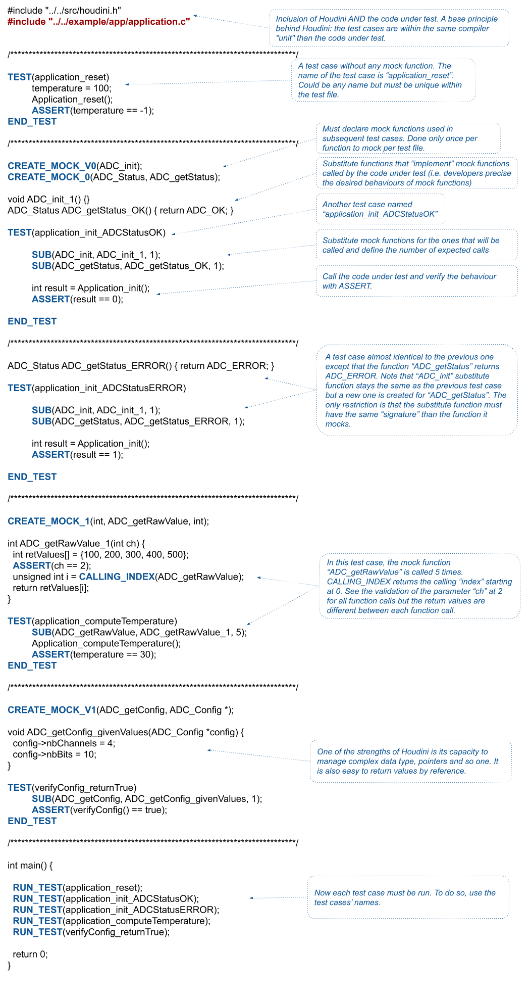

# Getting Started

First of all, get Houdini from github by cloning the project or by downloading it. In this document, we will present the structure of the project and then we will go through the example from test file *utest.c* that tests the code under test *application.c* that depends on *adc.h*.


## Presentation of Houdini directory structure

By cloning or downloading Houdini, you get

```
houdini
|-- doc
|-- example
|-- src
|-- test
```
where
* *docs* is the folder of Houdini documentation
* *example* presents the example used within this getting started
* *src* is the folder of the Houdini source code: *test.h* and *houdini.h*
* *test* is the folder of test cases used to test Houdini

In this getting started, we use the example source code and test project.

```
houdini
|-- example
    |-- app
        |-- adc.h
        |-- application.c
    |-- utest
        |-- Makefile
        |-- utest.c
```
where
* *application.c* is the code under test (CUT)
* *adc.h* is the code that the CUT depends on (i.e. this is the dependency of the CUT)
* *utest.c* is the test code (i.e. test cases and test runner)
* *Makefile* is the test project definition

The test cases defined in *utest.c* test functions defined in *application.c* that depends on *adc.h*. The *makefile* build the test project using GCC tool chain.

## Project setup

Before going into the test file explanation, it is important to see the global project usage, first in a project definition (a makefile using GCC in our case) and then in the framework as is.

### In project definition (*makefile*)

The test project must instruct the compiler with the path of the code under test and Houdini source code such way that the references are resolved. The example uses GCC tool chain but can be any type of development environment for any target. Here is the *Makefile* of the test project:

``` bash
all:
	gcc -I"../../src" -I"../../example/app" -Wall -Wextra -g -o utest.exe utest.c
```

Note that it is important to add ``-Wall`` compiler option. Explanation later (TODO: dire que c'est si un test est défini TEST..ENDTEST mais pas ajouté au test runner).

### In Houdini framework (*Houdini.h* and *test.h*)

Houdini framework is made of two files: *Houdini.h* that is the implementation of the mock mechanism and *test.h* that defines the way used by Houdini to output the test results. *Houdini.h* is portable and should not be modified. *test.h* can be modified by the developers for their given development environments.  

*test.h* makes 4 definitions:
* ``PRINT(text)`` that prints the given *text*
* ``PRINT_INT(nb)`` that prints the given number *nb* in integer format
* ``FLUSH()`` that blocks until all data has been outputted correctly
* ``ASSERT(test)`` that outputs an error if the given *test* is false

The release version of Houdini uses ``printf`` and ``fflush`` in *test.h*. If your development environment supports them, you can let *test.h* unchanged. However, modifying the definitions for a microcontroller (or another kind of output) should not be a challenge.

## The shelled example

This section presents almost all Houdini's macros:

* CREATE_MOCK_x(...)
* TEST(testName) ... END_TEST
* SUB(funcName, subName, nbOfCalls)
* ASSERT(test)
* RUN_TEST(testName)
* CALLING_INDEX(cutName)

 The next section completes the presentation of the rest of Houdini's macros. Here is the *utest.c* example explained while using Houdini's macros:



## General setup and teardown

It can be convenient to use general setup and teardown that are executed for each test cases. It is easily done, see the following example (note that this one is not part of the Houdini *exemple* folder and files):

``` C
Sensor * sensor = NULL;

void setup_1() {
  sensor = malloc(sizeof(Sensor));
  sensor->init = false;
}

void setup_2() {
  sensor = malloc(sizeof(Sensor));
  sensor->init = true;
}

void teardown() {
  free(sensor);
}

int main() {
  
  RUN_TEST(testCase1);

  ATTACHED_SETUP(setup_1);
  ATTACHED_TEARDOWN(teardown);
  RUN_TEST(testCase2);
  RUN_TEST(testCase3);

  ATTACHED_SETUP(setup_2);
  RUN_TEST(testCase4);

  ATTACHED_SETUP(NULL);
  ATTACHED_TEARDOWN(NULL);
  RUN_TEST(testCase5);

  return 0;
}
```

## Project strategies

Test strategy: un main par fichier, plusieurs fichiers pour un seul main...

## Last details

* 
* Pourquoi -Wall
* Les outputs...
* #define HOUDINI dans houdini.h, ça peut servir entre autre pour tester main
* L'ordre de création des CREATE_MOCK_x
* Developers have all the latitude to manipulate complex data types and pointers easily. Note that since the code under test is *included* with the test code, static definitions like the function ``verifyConfig`` and the global variable ``temperature`` can be used and tested.

## Synthesis (on va en faire un vrai getting started)

``` C
// This is a test file.

#include "path/to/houdini.h"   // Framework installation... Nothing more to do!
#include "path/to/cut.c"       // IMPORTANT: the code under test.

CREATE_MOCK_1(int, depFunc, float);  // Creates the mock mechanism for the function "depFunc".
                                     // Done only once per function to mock and per test file.

int depFunc_sub(float x) { ASSERT(x < 100.0); return 1; }  // Substitution function that will be 
                                                           // called by the code under test instead.

TEST(testName)                    // Starting point of the test case plus test case's name definition.

	SUB(depFunc, depFunc_sub, 2);   // Substitution of "depFunc" by "depFunc_sub" and indication
                                  // that the function will be called 2 times.

	int result = cutFunc();         // Execution of the code under test
	ASSERT(result == 0);            // and test of the results if required.
END_TEST

int main() {
  RUN_TEST(testName);             // Run the given test case.
  return 0;
}
```

